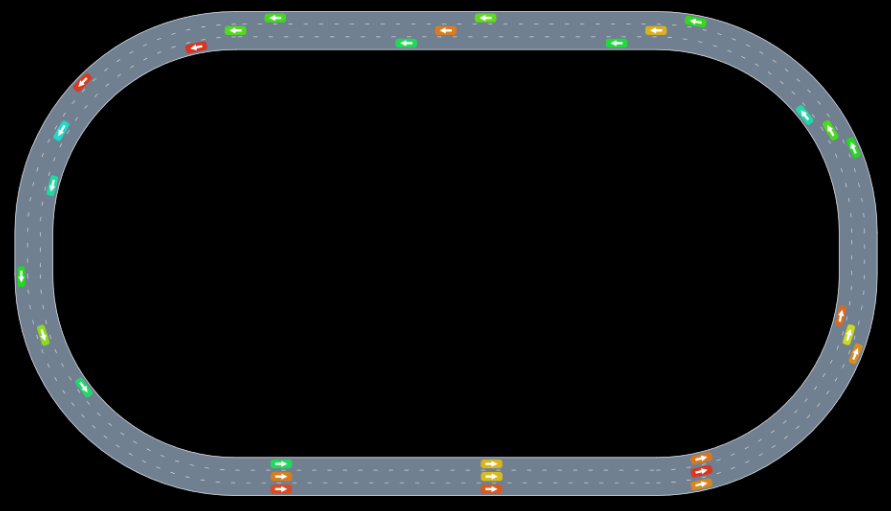

# AutoViz

[](https://travis-ci.org/sisl/AutoViz.jl)
[](https://coveralls.io/r/sisl/AutoViz.jl)

A package for rendering simple scenes primarily consisting of cars on roadways using Cairo.



## Usage

The main function is

```julia
render(scene)
```

where scene is an iterable of renderable objects including cars and roadways.

Example:
```julia
roadway = gen_straight_roadway(3, 100.0)
car = ArrowCar([0.0, 0.0], 0.0, color=colorant"blue") # [north, east], angle
render([roadway, car, "some text"])
```

### Renderable

*What does it mean to be "renderable"?*

An object is *directly renderable* if the function `render!(rm::RenderModel, object)` is implemented for it.

An object is *renderable by conversion* if `convert(Renderable, object)` returns a directly renderable object.

When `render()` is invoked, direct renderability is checked with `isrenderable(object)`, which defaults to `method_exists(render!, Tuple{RenderModel, typeof(object)})`. If this check fails, a conversion attempt is made with `convert(Renderable, object)`.

### Roadways and ArrowCars

The primary basic directly renderable types are `Roadway` (now from `AutomotiveDrivingModels`; soon from `Roadways.jl`) and `ArrowCar`.

`ArrowCar`s are the pink cars with arrows that are in everyone's videos. You can construct one like this:

```julia
using Colors
using AutoViz

# x, y, angle and velocity are from your simulation

ArrowCar(x, y, angle; color=colorant"green", text="v: $velocity")
```

### How to make types renderable

There are two ways to make renderable types.

1. You can make your existing types renderable by conversion by defining `convert(::Type{Renderable}, ::MyType)` which should return a directly renderable object, e.g. an `ArrowCar`.
2. You can make types directly renderable by defining `render!(::RenderModel, ::MyType)`. To make things easier for the compiler, you can also define `isrenderable(::Type{MyType}) = true`. If you want to allow others to convert to this type to make their types renderable by conversion, make your type a subtype of `Renderable`.

## Overlays

Overlays will function as in the previous version of AutoViz. They will be rendered last with `render!(rendermodel, overlay, scene)`.

## Additional keyword arguments for `render()`

The following additional keyword arguments will accepted by `render()`:

- `canvas_width`
- `canvas_height`
- `rendermodel`
- `overlays`
- `cam` - a camera controlling the field of view as in the previous version of AutoViz

## `RenderModel`s

The mid-level interface for this package (which is what you will use when you write `render!()` for your types or when you write an overlay) revolves around adding instructions to a `RenderModel`. Each instruction consists of a function and a tuple of arguments for the function. This is not documented in this readme, but it is fairly easy to figure out by reading `rendermodels.jl`, `overlays.jl`, and `arrowcar.jl`.
